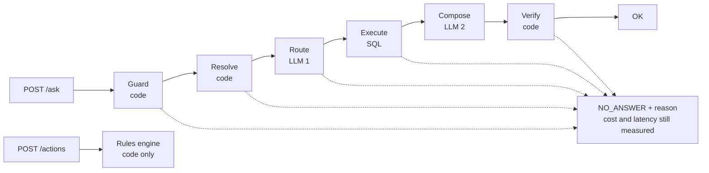

# ACPL Sales Focus & Action Assistant — Approach

**Scope:** `POST /ask`, `POST /actions` over FY26 (Jul 2025 – Jun 2026): 7 CSV exports, 6 working documents, 1 action playbook.
**Artefacts:** [DESIGN.md](DESIGN.md) (detailed design, diagrams, module map) · [README.md](README.md) (contract, run, extra fields) · [ARTEFACT.md](ARTEFACT.md) / [ARTEFACT.html](ARTEFACT.html) (self-audit) · [eval/](eval/) (evaluation and committed results) · [`prepare.py`](prepare.py) · [`src/acpl_assistant/service.py`](src/acpl_assistant/service.py).

**Principle.** Numbers are computed by code, never by a model. The LLM classifies the question and
renders prose; every figure originates in a SQL result, every action in a playbook rule evaluated in
code. A question that maps to no supported intent has no execution path — that is what makes refusal
reliable.

## A. Problem decomposition

Sales-ops asks three things each Monday: which brands slip against target, which territories lag,
where a stock-out is undoing a promotion. The taxonomy maps onto these (Q1; Q2/Q3; Q4+Q5); the rules
in D are the playbook's response. One parameterised query family per category in
[`src/acpl_assistant/ask/intents.py`](src/acpl_assistant/ask/intents.py).

| ID | Category | Example |
|---|---|---|
| Q1 | Target vs actual, gap ranking | Where are we losing most against target this quarter? |
| Q2 | Sales aggregation and ranking | Top 5 brands by value in the South in Q3 |
| Q3 | Period comparison | How did Beverages in the West move Q3 to Q4? |
| Q4 | Stock-out analysis | Which distributors were worst on Aqualite? |
| Q5 | Promotion effectiveness | Did the Buy 2 Get 1 on the 1L pack work? |
| Q6 | Document-grounded cause and policy | Why did CremeDelight miss in the North in February? |
| Q7 | Action queries → `/actions` engine | What should we do about the West? |
| Q8 | Coverage and metadata | Which brands and regions are held? |

**Actions:** the eight playbook rules — supply-constrained (R-01, R-04, R-08; approval-gated),
promotion-related (R-02, R-07), unexplained miss (R-03, R-05, R-06).

**Refusals** are first-class, each with eval cases ([`src/acpl_assistant/ask/resolve.py`](src/acpl_assistant/ask/resolve.py),
[`src/acpl_assistant/ask/guard.py`](src/acpl_assistant/ask/guard.py)): unknown entity — checked against vocabularies from the
masters before any LLM call; out of period; unsupported metric (secondary sales, margin, share);
false premise — refused with the contradicting figure; injection or configuration probe.

**Time** anchors to the latest data week (2026-06-23), not the clock: "this quarter" is FY26 Q4.
Quarters are fiscal (Q1 = Jul–Sep).

**Not built, by design:** free-form text-to-SQL (see F); forecasting and causal inference (the SOP
forbids attributing a cause the evidence does not show); multi-turn memory; executing actions.

## B. System design

Python 3.14, FastAPI on uvicorn (`PORT` from env), DuckDB single-file store, pandas, rapidfuzz, one
LLM provider over httpx. `prepare.py` builds `warehouse.duckdb` and `prep_report.json` offline in one
command; the service only reads.

The model makes two schema-bound decisions: **route** ([`src/acpl_assistant/ask/router.py`](src/acpl_assistant/ask/router.py)) —
one intent from Q1–Q8 plus slots, as JSON; **compose** ([`src/acpl_assistant/ask/compose.py`](src/acpl_assistant/ask/compose.py))
— prose from the evidence rows, which is all it sees. Code owns everything else.

**Failure path.** Every stage degrades only to `NO_ANSWER`: unknown entity or injection before a
token is spent; no intent or low confidence; zero rows. The verifier
([`src/acpl_assistant/ask/verify.py`](src/acpl_assistant/ask/verify.py)) re-extracts every numeral in the answer and asserts it is
present in `evidence`; an ungrounded figure fails closed. Provider errors return `NO_ANSWER` with
the reason.

## C. Data & grounding

**Routing.** The intent fixes the source set — Q1/Q3 sales-vs-target, Q4 stock-outs via the
distributor master, Q5 promotion windows against weekly sales, Q6 the tagged document table, Q8 dims.

**Documents.** Six `.docx`, held whole; at prep ([`src/acpl_assistant/prepare/load.py`](src/acpl_assistant/prepare/load.py)) code
tags each with the brands, regions, distributors and months it names. Load-bearing: the North visit
note (CremeDelight's February miss attributed to a competitor; no supply issue, no promotion — the
sole discriminator between R-03 and R-06); the West distributor note (D032/D033, Beverages 1L,
Apr–Jun — corroborates R-01/R-04); the escalation SOP (approval gate; "never invent a reason"); the
promo circular (both mechanics verified as PR-2026-005, PR-2025-011). Routine, never cited: W32
summary, HR circular. A document supports a figure, never produces one.

**Reconciliation** in code ([`src/acpl_assistant/prepare/conform.py`](src/acpl_assistant/prepare/conform.py)), files untouched,
logged to `prep_report.json`:

| # | Mismatch | Resolution · verified |
|---|---|---|
| 1 | SKU key: `sku_code` / `sku` / `item_code` | Conform to `sku_code` · 0 orphans |
| 2 | `brand_name`, `region_name` (targets) vs `brand`, `region` (dims) | Conform to dim names · 720/720 |
| 3 | `stockouts.region` is portal free text — 16 spellings of 4 regions | Derive via `distributor_id → territory → region`; portal text only cross-checks · 0 conflicts in 520 |
| 4 | Dates: ISO, `YYYY-MM`, `DD/MM/YYYY` | Explicit `%d/%m/%Y` for promotions, never inferred |
| 5 | **Grain**: SKU × territory × week vs brand × region × month | Roll up via both masters; week → month of `week_start` (dictionary rule) · 720/720 cells |
| 6 | Promotions are SKU × region × date-window | Match weeks by date overlap · 39/40 measurable |
| 7 | Playbook thresholds are prose in Excel | Parsed once into typed rules ([`src/acpl_assistant/actions/rules.py`](src/acpl_assistant/actions/rules.py)) |

`evidence` carries the rows behind the answer with `source_file`; actions carry `rule_id` and the
triggering figures.

## D. Actions & approval

An **action** is one rule matched against one entity over a stated period, with the triggering
figures. No match, no action — `/actions` returns `[]`, never filler. Rules run over all of FY26,
independently; a cell may yield one action per rule (R-03/R-06 are exclusive by construction).

| Rule | Condition as coded | Approval | Fires in FY26 |
|---|---|---|---|
| R-01 | ach < 70% and ≥ 2 stock-out weeks on the brand's SKUs in the region | **Yes** | Aqualite / West / Apr–Jun at 62% |
| R-02 | ach < 80%, promotion overlapping the month, uplift < 10% | No | none |
| R-03 | ach < 80%, no stock-out, no promotion, supporting note | No | CremeDelight / North / Feb at 72% |
| R-04 | distributor × SKU out > 6 weeks | **Yes** | D032, D033 × BV-0104, 9 weeks each |
| R-05 | ach > 110% | No | none (max 108.7%) |
| R-06 | ach < 80%, no stock-out, no promotion, no note | No | MintGuard / East / Mar at 74% |
| R-07 | promotion uplift > 25% | No | 23 promotions |
| R-08 | distributor with ≥ 3 SKUs out in a month | **Yes** | 47 distributor-months, 27 distributors |

R-02 and R-05 have no qualifying case; both stay implemented and eval-covered. Findings are grouped
by the entity the action targets (one R-01 for Aqualite / West citing three months; one R-08 per
distributor), ranked by recency and INR at risk, never capped; each carries `period`, `evidence`,
`priority`. `scope` resolves case-insensitively to a region or `all`; anything else is withheld as
`[]`.

**Gating.** `state` is read from the playbook's `needs_approval` column: R-01, R-04, R-08 are
`PENDING_APPROVAL`, the rest `RECOMMENDED`. The SOP agrees — escalations, replenishment orders and
distributor calls change a commitment. Nothing is executed in either state.

## E. Operations

**Cost** ([`src/acpl_assistant/obs/meter.py`](src/acpl_assistant/obs/meter.py), [`src/acpl_assistant/llm/pricing.py`](src/acpl_assistant/llm/pricing.py)):
token counts from the provider's `usage` block — not an estimate, not a constant — priced against a
per-model rate table and summed over the request's LLM calls. A pre-routing refusal reports `0.0`.
The key is free-tier; `cost_usd` is the list-price equivalent of tokens consumed (stated in README).

**Latency:** `perf_counter_ns` around the whole handler, provider round-trip included; per-stage
`timings_ms` as an extra field.

**Accuracy:** [`eval/questions.yaml`](eval/questions.yaml) covers every question and refusal category
with paraphrases; each case asserts `status` and, for `OK`, the figure that must appear in `evidence`.
One run yields accuracy, cost and latency. First accuracy, biggest gap, the one change, accuracy
after, median cost and p50/p95 latency are in [ARTEFACT.md](ARTEFACT.md).

## F. Trade-offs

| Decision | Gained | Given up |
|---|---|---|
| Fixed intents, not text-to-SQL | Reproducible figures; refusal that works | Tail questions refused even where SQL could answer |
| `/actions` without an LLM | Zero fabrication on what a manager acts on; no cost | Templated action text |
| Numeric verifier on every answer | Ungrounded figures fail closed | An unusually phrased correct number can be refused |
| Uplift baseline: 4 pre-promo weeks, same SKU × region | Explainable, auditable | No seasonality correction; all 39 promotions show +13.5–44.7%, hence no R-02 case |
| Region derived from `distributor_id` | Immune to 16 portal spellings | Drops a field that could disagree — mitigated by asserting 0 conflicts at prep |
| Two LLM calls per question | Narrow, testable decisions | Roughly twice the latency of one fused call |
