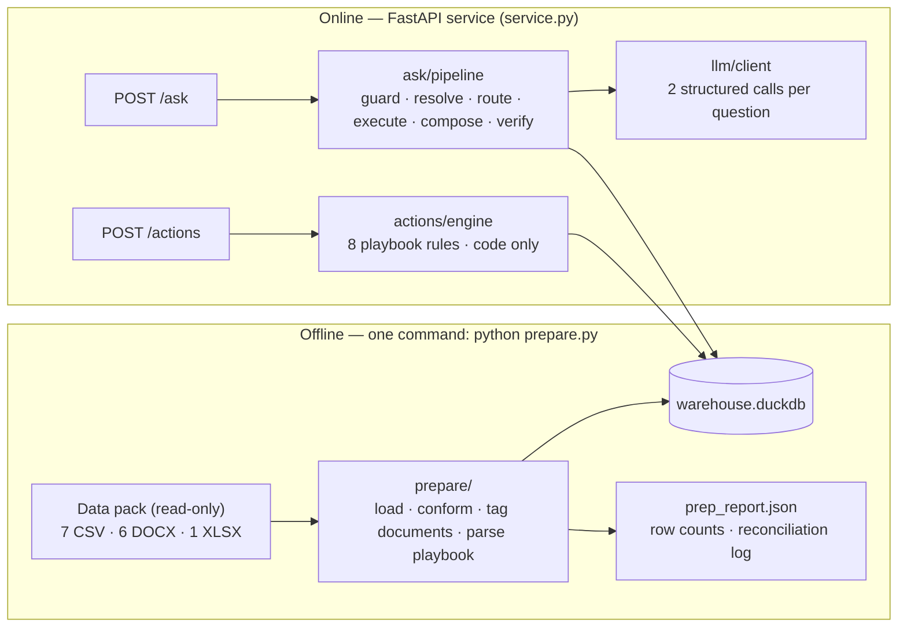
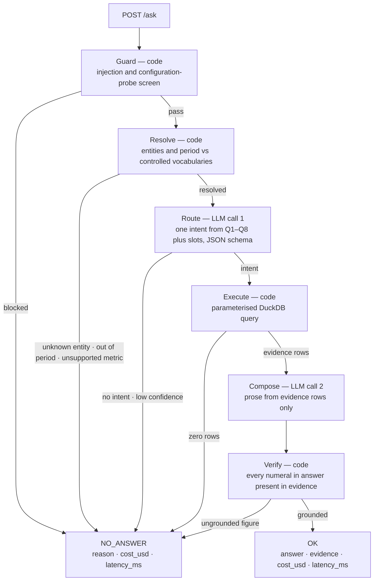
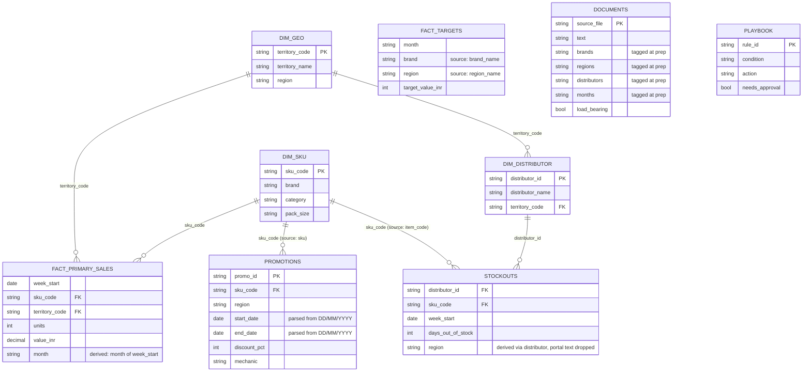
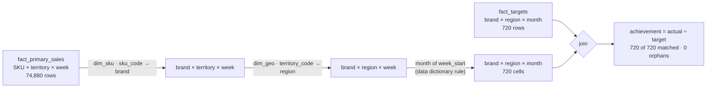
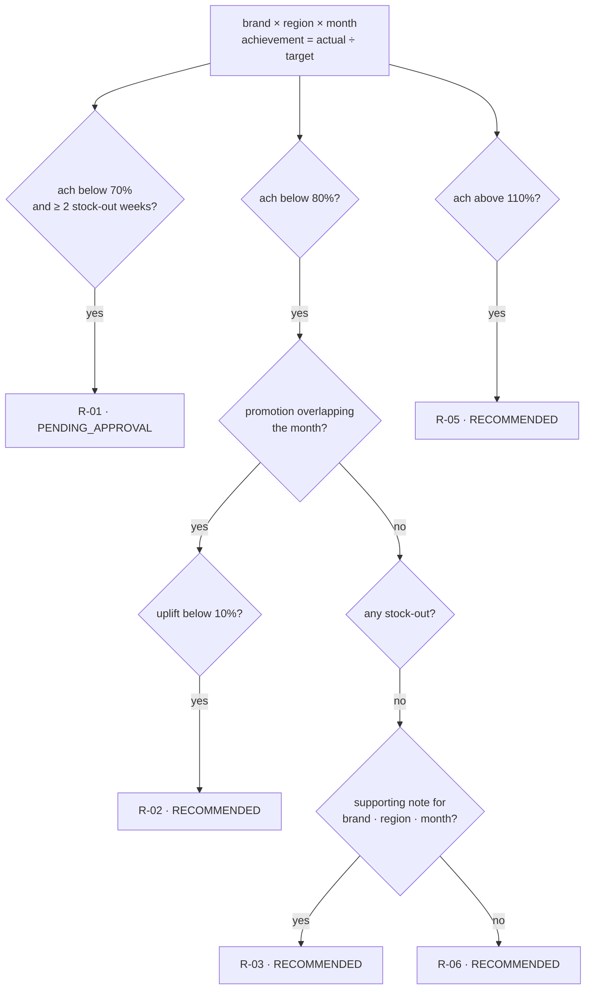
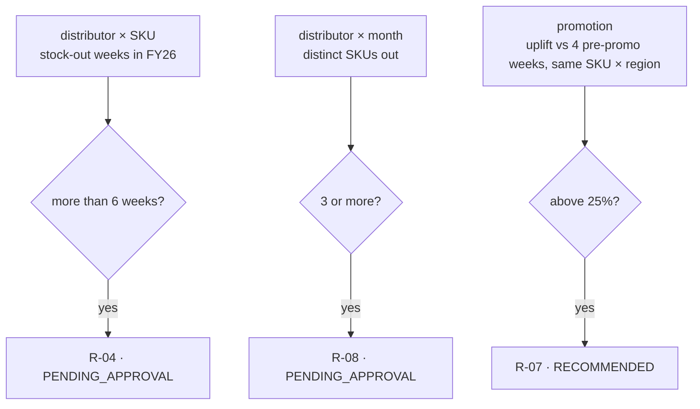
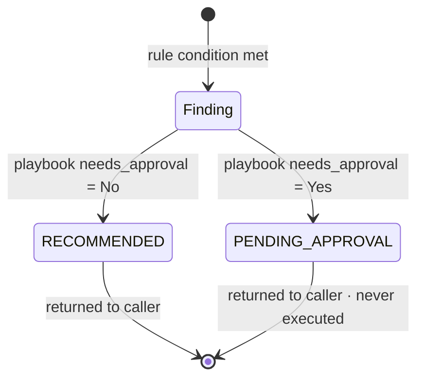
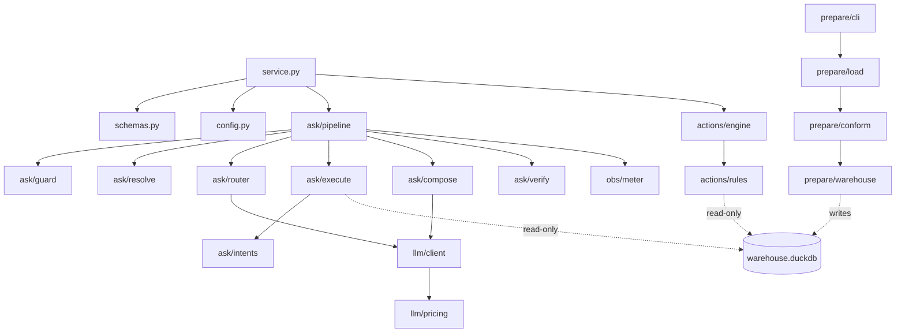

# ACPL Sales Focus & Action Assistant — System Design

| | |
|---|---|
| **Document** | DESIGN.md — detailed design. The two-page summary required by the brief is [APPROACH.md](APPROACH.md); this document expands it without changing it |
| **System** | Sales Focus & Action Assistant, v2 (`POST /ask`, `POST /actions`) |
| **Client** | Aravalli Consumer Products Ltd (ACPL), Sales Operations |
| **Data scope** | FY26 (1 Jul 2025 – 30 Jun 2026); 7 CSV exports, 6 working documents, 1 action playbook |
| **Status** | Design baseline — committed ahead of implementation; kept current with the build |

**Contents**
1. [Overview](#1-overview)
2. [Problem Decomposition (A)](#2-problem-decomposition-a)
3. [System Design (B)](#3-system-design-b)
4. [Data & Grounding (C)](#4-data--grounding-c)
5. [Actions & Approval (D)](#5-actions--approval-d)
6. [Operations (E)](#6-operations-e)
7. [Trade-offs (F)](#7-trade-offs-f)
8. [Repository & Engineering Standards](#8-repository--engineering-standards)
- [Appendix A — Interface summary](#appendix-a--interface-summary)
- [Appendix B — Module and artefact index](#appendix-b--module-and-artefact-index)

---

## 1. Overview

### 1.1 Purpose

Every Monday ACPL's sales-operations team decides where the field force spends the week. The
existing assistant answers roughly three questions in five, recommends nothing, and exposes no cost
or latency. This design delivers the next version: answers grounded in the data, weekly actions
grounded in ACPL's own playbook, approval gating for anything that would notify or commit, and
per-request cost and latency instrumentation.

### 1.2 Governing principle

**Numbers are computed by code, never by a model.** The LLM performs two narrow, schema-bound
tasks — classifying the question and rendering prose — and never sees the warehouse. Every figure
in an answer originates in a SQL result; every action originates in a playbook rule evaluated in
code. A question that maps to no supported intent has no execution path, which is what makes
refusal reliable rather than probabilistic.

### 1.3 Artefacts

| Artefact | Purpose |
|---|---|
| [APPROACH.md](APPROACH.md) | Two-page design summary (sections A–F) required by the brief |
| [README.md](README.md) | Data preparation, running the service, fields beyond the contract, pricing table |
| [ARTEFACT.md](ARTEFACT.md) · [ARTEFACT.html](ARTEFACT.html) | Self-audit in measured numbers: row counts, national total, reconciliations, evaluation results |
| [eval/](eval/) | Labelled evaluation set, runner, committed results |
| [`prepare.py`](prepare.py) | One-command data preparation (shim over the package CLI) |
| [`src/acpl_assistant/`](src/acpl_assistant/) | The service and preparation package (module map in [§8.1](#81-repository-layout)) |

---

## 2. Problem Decomposition (A)

### 2.1 Fit to the operating rhythm

The brief names three Monday questions: which brands are slipping against target, which
territories are lagging, and where a stock-out is undoing a promotion the company is paying for.
The question taxonomy maps onto these directly (Q1; Q2/Q3; Q4+Q5), and the action taxonomy is the
playbook's prescribed response to each.

### 2.2 Question taxonomy

Each category is one parameterised query family in
[`ask/intents.py`](src/acpl_assistant/ask/intents.py). This is the list the system is exercised
against.

| ID | Category | Representative question | Sources |
|---|---|---|---|
| Q1 | Target vs actual, gap ranking | Where are we losing most against target this quarter? | sales, targets |
| Q2 | Sales aggregation and ranking | Top 5 brands by value in the South in Q3 | sales, dims |
| Q3 | Period comparison | How did Beverages in the West move from Q3 to Q4? | sales |
| Q4 | Stock-out analysis | Which distributors were worst on Aqualite? | stockouts, dims |
| Q5 | Promotion effectiveness | Did the Buy 2 Get 1 on the 1L pack work? | promotions, sales |
| Q6 | Document-grounded cause and policy | Why did CremeDelight miss in the North in February? | documents |
| Q7 | Action queries | What should we do about the West? | delegates to the `/actions` engine |
| Q8 | Coverage and metadata | Which brands and regions are held? | dims |

### 2.3 Action taxonomy

The eight playbook rules, grouped into three families. Full specification in [§5](#5-actions--approval-d).

| Family | Rules | Character |
|---|---|---|
| Supply-constrained | R-01, R-04, R-08 | Notify or commit — approval-gated |
| Promotion-related | R-02, R-07 | Review or replicate — analysis only |
| Unexplained miss | R-03, R-05, R-06 | Investigate or capture — analysis only |

### 2.4 Refusal taxonomy

`NO_ANSWER` is a designed output with its own eval cases, not an error path. Implemented in
[`ask/resolve.py`](src/acpl_assistant/ask/resolve.py) and
[`ask/guard.py`](src/acpl_assistant/ask/guard.py).

| Class | Detection | Point of refusal |
|---|---|---|
| Unknown entity | Brand, region, territory or distributor absent from controlled vocabularies built from the masters (15 brands, 4 regions, 12 territories, 40 distributors, 120 SKUs) | Before any LLM call |
| Out of period | Reference outside FY26 | Before any LLM call |
| Unsupported metric | Secondary sales, margin, profitability, market share, competitor volumes — none in the pack | Before any LLM call |
| False premise | Assertion contradicted by the data; refused with the contradicting figure | After execution |
| Injection / configuration probe | Embedded instructions to ignore rules or disclose configuration | Before any LLM call |

### 2.5 Temporal semantics

Relative time references anchor to the **latest week in the data (2026-06-23)**, not the wall
clock. "This quarter" resolves to FY26 Q4 (Apr–Jun 2026); "this week" to the week of 23 June.
Quarters are fiscal: Q1 = Jul–Sep, Q2 = Oct–Dec, Q3 = Jan–Mar, Q4 = Apr–Jun. Clock-anchored
resolution would render the brief's own example question unanswerable once the data period has
passed.

### 2.6 Non-goals

| Excluded | Rationale |
|---|---|
| Free-form text-to-SQL | Fixed intents trade tail coverage for determinism and reliable refusal — see [§7](#7-trade-offs-f) |
| Forecasting and causal inference | The escalation SOP forbids attributing a cause the evidence does not show |
| Multi-turn memory | The contract is single-shot; both endpoints are stateless |
| Executing actions | The service has no outbound channel and no write path |

---

## 3. System Design (B)

### 3.1 Technology stack

| Layer | Choice |
|---|---|
| Runtime | Python ≥ 3.11 (developed on 3.14; CI on 3.11 and 3.12; container on 3.12) |
| HTTP | FastAPI on uvicorn; port from `PORT` |
| Contract models | Pydantic v2 ([`schemas.py`](src/acpl_assistant/schemas.py)) |
| Analytical store | DuckDB, single file, read-only at serve time |
| Preparation | pandas, openpyxl (playbook), python-docx (documents) |
| Entity resolution | rapidfuzz against controlled vocabularies |
| LLM access | One external provider over httpx, operator's own key, usage-metered |
| Packaging | `pyproject.toml`, setuptools, src layout, console scripts `acpl-prepare` and `acpl-serve` |
| Quality | Ruff (lint + format), pytest + coverage, pre-commit, GitHub Actions |

### 3.2 Topology



### 3.3 `/ask` pipeline and failure path

Every stage degrades only to `NO_ANSWER`; no stage can degrade to a guess. Orchestration lives in
[`ask/pipeline.py`](src/acpl_assistant/ask/pipeline.py).



### 3.4 Decision ownership

| Decision | Owner | Module |
|---|---|---|
| Is the question safe to process? | Code | [`ask/guard.py`](src/acpl_assistant/ask/guard.py) |
| Which entities and period does it reference? | Code | [`ask/resolve.py`](src/acpl_assistant/ask/resolve.py) |
| Which intent, with which slots? | **LLM** — JSON against a fixed schema | [`ask/router.py`](src/acpl_assistant/ask/router.py) |
| What are the figures? | Code — SQL | [`ask/intents.py`](src/acpl_assistant/ask/intents.py) · [`ask/execute.py`](src/acpl_assistant/ask/execute.py) |
| How is the result phrased? | **LLM** — sees evidence rows only | [`ask/compose.py`](src/acpl_assistant/ask/compose.py) |
| Is every figure in the answer grounded? | Code | [`ask/verify.py`](src/acpl_assistant/ask/verify.py) |
| Which rules fire, on what, with what state? | Code | [`actions/rules.py`](src/acpl_assistant/actions/rules.py) · [`actions/engine.py`](src/acpl_assistant/actions/engine.py) |

Provider errors or timeouts produce `NO_ANSWER` with the reason; cost and latency are still
measured and reported.

### 3.5 LLM provider boundary

The service talks to exactly one provider through [`llm/client.py`](src/acpl_assistant/llm/client.py):
OpenAI-compatible chat completions with JSON-schema response format, over httpx, with a per-call
timeout. Both calls (route, compose) are structured-output calls; free text never flows from the
model into a numeric field. The provider returns a `usage` block with each response, which is the
only input to cost accounting (§6.1).

The credential is the operator's own key, read from `LLM_API_KEY`. The OpenCode build token used
during development is never read by the service and never reaches the repository.

### 3.6 Configuration

All configuration is environment-driven and typed in [`config.py`](src/acpl_assistant/config.py);
[`.env.example`](.env.example) documents every variable.

| Variable | Default | Purpose |
|---|---|---|
| `PORT` | `8000` | Listen port (brief requirement) |
| `LOG_LEVEL` | `INFO` | Structured log verbosity |
| `ACPL_DATA_DIR` | `data/fmcg-sales-copilot-ai-engineer-mid-4to6` | Read-only input pack |
| `ACPL_WAREHOUSE` | `warehouse.duckdb` | Output of `prepare.py`; opened read-only by the service |
| `LLM_PROVIDER` · `LLM_MODEL` | `gemini` · `gemini-2.5-flash` | Selects the rate-table row in [`llm/pricing.py`](src/acpl_assistant/llm/pricing.py) |
| `LLM_API_KEY` | — | Operator's own key; absence makes every `/ask` a `NO_ANSWER` with reason, never a crash |
| `LLM_BASE_URL` | provider default | Override for OpenAI-compatible endpoints |
| `LLM_TIMEOUT_S` | `30` | Per-call provider timeout |

---

## 4. Data & Grounding (C)

### 4.1 Source routing

The resolved intent fixes the source set; there is no retrieval step to misfire. Q1 and Q3 read
the sales-vs-target fact; Q4 reads stock-outs joined through the distributor master; Q5 matches
promotion windows to weekly sales; Q6 reads the tagged document table; Q8 reads the dims alone.

### 4.2 Conformed data model

Written by [`prepare/warehouse.py`](src/acpl_assistant/prepare/warehouse.py).



### 4.3 Grain reconciliation

Sales are recorded at SKU × territory × week; targets at brand × region × month. Sales roll up
through both masters and across the calendar before comparison.



### 4.4 Reconciliation log

Performed in code in [`prepare/conform.py`](src/acpl_assistant/prepare/conform.py); source files
are never edited. Each item is written to `prep_report.json`, and the verified counts are asserted
at preparation time so a changed input fails the build rather than silently shifting figures.

| # | Mismatch | Resolution | Verified |
|---|---|---|---|
| 1 | SKU key named `sku_code` (sales, dim), `sku` (promotions), `item_code` (stock-outs) | Conform all to `sku_code` | Zero orphans across 74,880 + 520 + 40 rows |
| 2 | `brand_name` / `region_name` in targets vs `brand` / `region` in dims | Conform to dim names | 720 of 720 target rows match |
| 3 | `stockouts.region` is portal free text — 16 spellings of 4 regions | Derive region via `distributor_id → territory_code → dim_geo.region`; normalise the portal string only to cross-check, then drop it | 0 conflicts in 520 rows |
| 4 | Three date formats — ISO, `YYYY-MM`, `DD/MM/YYYY` | Parse each explicitly; promotions with `%d/%m/%Y`, never inferred | `01/07/2025` cannot become January |
| 5 | Grain: SKU × territory × week vs brand × region × month | Roll up per §4.3 | 720 of 720 cells join, no orphans either side |
| 6 | Promotions are SKU × region × date-window | Match to weeks by date-range overlap, not month equality | 39 of 40 measurable (one starts in week 1, no pre-window) |
| 7 | Playbook thresholds are prose in Excel | Parse once into typed rules with numeric thresholds | [`actions/rules.py`](src/acpl_assistant/actions/rules.py) |

### 4.5 Documents

Six `.docx`, held whole — no vector store or chunking. At preparation
([`prepare/load.py`](src/acpl_assistant/prepare/load.py)) code tags each document with the
brands, regions, distributors and months it names, by matching the controlled vocabularies.

| Document | Classification | Role |
|---|---|---|
| `visit_note_north_feb2026.docx` | Load-bearing | Attributes CremeDelight's February North miss to a competitor; states no supply issue and no promotion. Sole discriminator between R-03 and R-06 |
| `distributor_note_west.docx` | Load-bearing | Names D032/D033, Beverages 1L, April–June, slow replenishment. Corroborates R-01 and R-04 |
| `escalation_sop.docx` | Load-bearing (governance) | Source of the approval gate and the "never invent a reason" rule |
| `promo_circular_h2fy26.docx` | Partially load-bearing | Two approved mechanics, both verified in `promotions.csv` (PR-2026-005, PR-2025-011) |
| `weekly_summary_w32.docx` | Routine | No answer content; never cited |
| `hr_circular.docx` | Routine | Unrelated to sales; never cited |

A document may **support** a figure but never **produce** one. The visit note names Jaipur and
Lucknow, yet the February dip is uniform across all three North territories (−24%, −28%, −24%);
the finding therefore stands at brand × region, as the numbers show it.

### 4.6 Evidence contract

`evidence` carries the rows the answer was computed from, each with its `source_file`
([`ask/execute.py`](src/acpl_assistant/ask/execute.py)). Actions carry `rule_id` and the
triggering figures. The numeric verifier (§3.3) makes grounding a structural property of the
response rather than a matter of prompt discipline.

---

## 5. Actions & Approval (D)

### 5.1 Definition

An **action** is one playbook rule, matched against one entity, over a stated period, carrying
the figures that triggered it. No rule match means no action; `/actions` returns `[]` for a scope
with nothing to report.

### 5.2 Rule evaluation

Rules ([`actions/rules.py`](src/acpl_assistant/actions/rules.py)) are evaluated over **all of
FY26**, independently. A cell may satisfy more than one rule and yields one action per rule;
R-03 and R-06 are mutually exclusive by construction.





### 5.3 Rule specification and observed firing

Thresholds as coded, validated against the prepared warehouse.

| Rule | Condition as coded | Approval | Observed in FY26 |
|---|---|---|---|
| R-01 | ach < 70% and ≥ 2 stock-out weeks on the brand's SKUs in the region that month | **Yes** | Aqualite / West / Apr, May, Jun at 62% |
| R-02 | ach < 80%, promotion overlapping the month, uplift < 10% | No | None |
| R-03 | ach < 80%, no stock-out, no promotion, supporting note present | No | CremeDelight / North / Feb at 72% |
| R-04 | One distributor × SKU out of stock > 6 weeks in FY26 | **Yes** | D032 and D033 × BV-0104, 9 consecutive weeks each |
| R-05 | ach > 110% | No | None — maximum is 108.7% |
| R-06 | ach < 80%, no stock-out, no promotion, no supporting note | No | MintGuard / East / Mar at 74% |
| R-07 | Promotion uplift > 25% | No | 23 promotions |
| R-08 | Distributor with ≥ 3 distinct SKUs out in a month | **Yes** | 47 distributor-months across 27 distributors |

R-02 and R-05 have no qualifying case on this data. Both remain implemented and eval-covered; the
system reports no case rather than adjusting a threshold to produce output.

### 5.4 Grouping and ranking

R-07 and R-08 fire frequently. Findings are therefore **grouped by the entity the action targets**
([`actions/engine.py`](src/acpl_assistant/actions/engine.py)) — one R-01 for Aqualite / West
citing three months; one R-08 per distributor citing its months — then ranked by recency and INR
at risk. Nothing is capped: the list is complete. Each item carries `period`, `evidence` and
`priority` as fields beyond the contract.

### 5.5 Scope resolution

`scope` resolves case-insensitively to a region (`"west region"` → West) or to `all`. Any other
value is withheld as `[]`; the behaviour is documented in the README.

### 5.6 Approval gating



`state` is read from the playbook's `needs_approval` column, not inferred. R-01, R-04 and R-08
are `PENDING_APPROVAL`; the remainder `RECOMMENDED`. The escalation SOP agrees independently:
supply escalations, replenishment orders and distributor calls change a commitment; analysis and
review do not. The service has no outbound channel and no write path, so no action is executed in
either state.

---

## 6. Operations (E)

### 6.1 Cost

Measured per request in [`obs/meter.py`](src/acpl_assistant/obs/meter.py). Token counts are taken
from the provider's `usage` block — not a tokeniser estimate, not a constant — and priced against
a per-model rate table in [`llm/pricing.py`](src/acpl_assistant/llm/pricing.py), summed over the
request's LLM calls. A refusal caught before routing costs and reports `0.0`. The service runs on a
free-tier key, so billed spend is nil while `cost_usd` reports the list-price equivalent of tokens
actually consumed; the README states this distinction and the rate table.

### 6.2 Latency

`time.perf_counter_ns()` spans the whole handler — provider round-trip, SQL and verification
included — so `latency_ms` is what the caller waits. A per-stage breakdown is returned in an
optional `timings_ms` field.

### 6.3 Accuracy

[`eval/questions.yaml`](eval/questions.yaml) covers every question and refusal category with
paraphrase variants. Each case asserts the expected `status` and, for `OK`, the figure that must
appear in `evidence` — the number is checked, not the wording. A single run of
[`eval/run_eval.py`](eval/run_eval.py) against a running service yields accuracy, cost and
latency together. First-measured accuracy, the largest gap, the one change made, accuracy after,
and median cost with p50/p95 latency are reported in [ARTEFACT.md](ARTEFACT.md); results are
committed under `eval/results/`.

### 6.4 Observability and health

Structured JSON logs carry one line per request with `intent`, `status`, `cost_usd`, `latency_ms`
and the refusal reason where applicable; question text is logged only at `DEBUG`. A `GET /health`
endpoint reports warehouse availability and the configured model, and backs the container health
check. No secrets are ever logged.

---

## 7. Trade-offs (F)

| Decision | Gained | Given up |
|---|---|---|
| Fixed intent catalogue rather than text-to-SQL | Reproducible figures; refusal that works because unmapped questions have no execution path | Tail questions refused even where SQL could answer |
| `/actions` without an LLM | Zero fabrication on the output a manager acts on; no inference cost | Templated action text rather than per-case prose |
| Numeric verifier on every answer | Ungrounded figures fail closed | An unusually phrased correct number can be refused |
| Uplift baseline: 4 pre-promo weeks, same SKU × region | One-line explainable; auditable from evidence rows | No seasonality correction; all 39 measurable promotions show +13.5% to +44.7%, hence no R-02 case |
| Region derived from `distributor_id` | Immunity to the 16 portal spellings | Discards a field that could disagree — mitigated by asserting 0 conflicts at prep |
| Grouped, ranked, uncapped actions | Complete and usable | Longer response for `all` |
| DuckDB file rather than hosted database | One-command reproducibility from the provided files | Concurrency the read-only service does not need |
| Two LLM calls per question | Narrow, individually testable decisions | About twice the provider latency of one fused call |

---

## 8. Repository & Engineering Standards

### 8.1 Repository layout

Src layout with a single installable package; the brief's top-level artefacts stay at the root.

```
.
├── APPROACH.md                 # two-page summary (brief §A–F)
├── DESIGN.md                   # this document
├── README.md                   # contract, run instructions, extra fields, pricing table
├── ARTEFACT.md / ARTEFACT.html # self-audit
├── prepare.py                  # one-command preparation (shim → acpl_assistant.prepare.cli)
├── pyproject.toml              # packaging, ruff, pytest, coverage
├── requirements.txt            # pip convenience mirror of pyproject dependencies
├── Dockerfile · .dockerignore  # containerised service; prepares data at build time
├── Makefile                    # install · prepare · serve · lint · format · test · eval
├── .pre-commit-config.yaml     # ruff + hygiene hooks; data/ excluded
├── .env.example                # every runtime variable, documented
├── .github/workflows/ci.yml    # lint · format · prepare · test · data-unchanged guard
├── data/<pack>/                # provided data pack — read-only, committed for reproducibility
├── eval/
│   ├── questions.yaml          # labelled cases
│   ├── run_eval.py             # runner
│   └── results/                # committed run outputs
├── src/acpl_assistant/
│   ├── __init__.py             # version
│   ├── config.py               # typed settings from env
│   ├── schemas.py              # Pydantic request/response models
│   ├── service.py              # FastAPI app, /ask, /actions, /health, main()
│   ├── prepare/                # cli · load · conform · warehouse
│   ├── ask/                    # guard · resolve · router · intents · execute · compose · verify · pipeline
│   ├── actions/                # rules · engine
│   ├── llm/                    # client · pricing
│   └── obs/                    # meter
└── tests/
    ├── conftest.py
    ├── unit/                   # pure functions: resolve, verify, rules, pricing
    └── integration/            # prepared warehouse + HTTP app via TestClient (no live LLM)
```

### 8.2 Dependency boundaries



Rules: `prepare/` never imports from `ask/` or `actions/`; `actions/` never imports `llm/`
(the engine is LLM-free by design); only `llm/client` performs network I/O; only `prepare/`
writes to disk.

### 8.3 Code quality

| Concern | Tool | Configuration |
|---|---|---|
| Lint | Ruff | `pyproject.toml [tool.ruff.lint]`: pycodestyle, pyflakes, isort, naming, pydocstyle (Google), pyupgrade, bugbear, bandit, pylint subset, datetimez, print, pathlib, simplify, unused-arguments |
| Format | Ruff formatter | double quotes, 100 columns, LF, docstring code formatting |
| Tests | pytest, pytest-cov | `testpaths = tests`; `integration` and `llm` markers; branch coverage |
| Hooks | pre-commit | ruff check `--fix`, ruff format, whitespace/EOF/YAML/TOML/JSON checks, large-file and private-key detection; `data/` excluded from every hook |
| CI | GitHub Actions | matrix 3.11 / 3.12; lint → format → `python prepare.py` → tests → `git diff --exit-code -- data/` proves the pack is unchanged |

Line length is 100; `E501` is delegated to the formatter. Prints are forbidden except in the CLI,
the eval runner and the root shim. Naive `datetime` construction is a lint error (`DTZ`) so every
date in the pipeline is explicit.

### 8.4 Security and data-handling rules

- The data pack is never modified: excluded from formatters and hooks, and CI fails on any diff under `data/`.
- No secret is committed: `.env` is ignored, `.env.example` carries names only, `detect-private-key` runs on every commit.
- The service reads the warehouse read-only, has no write path, and no outbound channel other than the configured LLM provider.
- The OpenCode build token is not a runtime credential and is never read by the package.
- The container runs as a non-root user.

---

## Appendix A — Interface summary

Full contract and extra fields in [README.md](README.md); models in
[`schemas.py`](src/acpl_assistant/schemas.py).

| Endpoint | Request | Response | Extra fields |
|---|---|---|---|
| `POST /ask` | `{"question"}` | `answer`, `status` (`OK` \| `NO_ANSWER`), `evidence[]`, `cost_usd`, `latency_ms` | `timings_ms`, `intent` |
| `POST /actions` | `{"scope"}` — region or `all` | `[{finding, rule_id, action, state}]` with `state` ∈ `RECOMMENDED` \| `PENDING_APPROVAL` | `period`, `evidence`, `priority` per item |
| `GET /health` | — | `{status, warehouse, model}` | — |

## Appendix B — Module and artefact index

| Path | Section |
|---|---|
| [`prepare.py`](prepare.py) · [`prepare/cli.py`](src/acpl_assistant/prepare/cli.py) | §3.2 |
| [`prepare/load.py`](src/acpl_assistant/prepare/load.py) · [`prepare/conform.py`](src/acpl_assistant/prepare/conform.py) · [`prepare/warehouse.py`](src/acpl_assistant/prepare/warehouse.py) | §4.2–§4.5 |
| [`service.py`](src/acpl_assistant/service.py) · [`config.py`](src/acpl_assistant/config.py) · [`schemas.py`](src/acpl_assistant/schemas.py) | §3.2, §3.6, Appendix A |
| [`ask/guard.py`](src/acpl_assistant/ask/guard.py) · [`ask/resolve.py`](src/acpl_assistant/ask/resolve.py) · [`ask/router.py`](src/acpl_assistant/ask/router.py) · [`ask/intents.py`](src/acpl_assistant/ask/intents.py) · [`ask/execute.py`](src/acpl_assistant/ask/execute.py) · [`ask/compose.py`](src/acpl_assistant/ask/compose.py) · [`ask/verify.py`](src/acpl_assistant/ask/verify.py) · [`ask/pipeline.py`](src/acpl_assistant/ask/pipeline.py) | §3.3, §3.4 |
| [`actions/rules.py`](src/acpl_assistant/actions/rules.py) · [`actions/engine.py`](src/acpl_assistant/actions/engine.py) | §5 |
| [`llm/client.py`](src/acpl_assistant/llm/client.py) · [`llm/pricing.py`](src/acpl_assistant/llm/pricing.py) | §3.5, §6.1 |
| [`obs/meter.py`](src/acpl_assistant/obs/meter.py) | §6.1–§6.2 |
| [`eval/questions.yaml`](eval/questions.yaml) · [`eval/run_eval.py`](eval/run_eval.py) · `eval/results/` | §6.3 |
| [`pyproject.toml`](pyproject.toml) · [`.pre-commit-config.yaml`](.pre-commit-config.yaml) · [`.github/workflows/ci.yml`](.github/workflows/ci.yml) · [`Dockerfile`](Dockerfile) | §8 |
| [APPROACH.md](APPROACH.md) · [ARTEFACT.md](ARTEFACT.md) · [ARTEFACT.html](ARTEFACT.html) · [README.md](README.md) | §1.3 |
